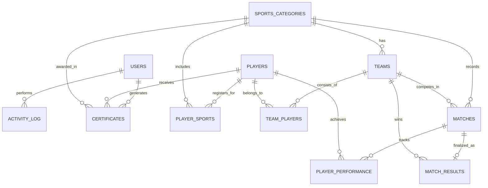
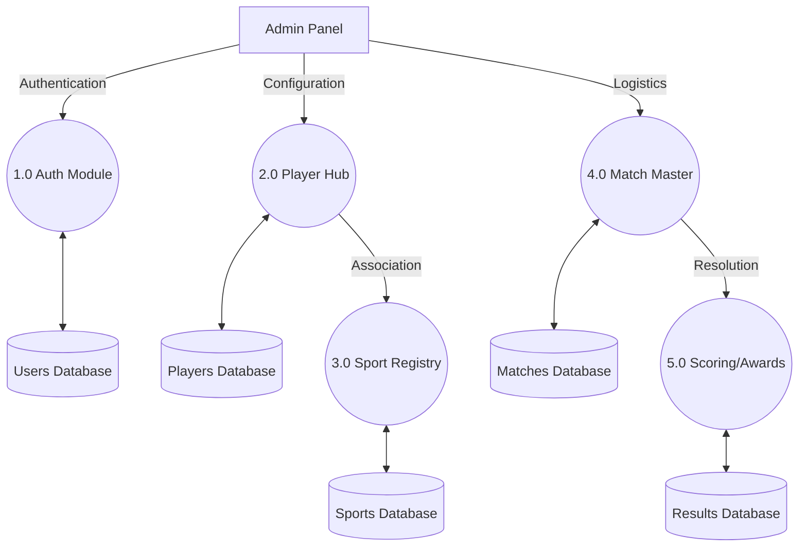
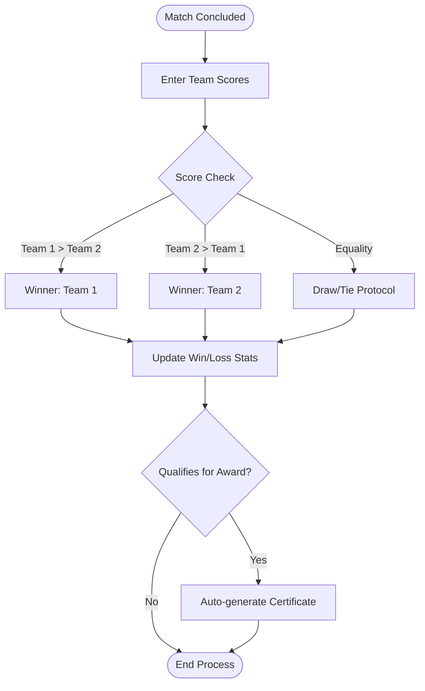
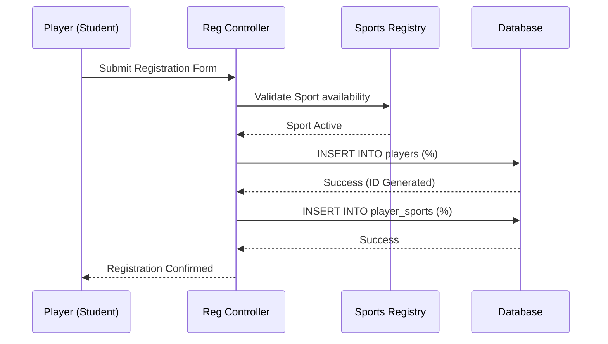

# College Sports Management System

<div align="center">
  
  <h2>College Sports Management System</h2>
  <p><b>Master Technical Report: [COMPLETE_PROJECT_REPORT.md](docs/COMPLETE_PROJECT_REPORT.md)</b></p>
  <p>A comprehensive, fully offline, and AI-ready sports management ERP for collegiate institutions.</p>
</div>

---

## Technical Overview

The College Sports Management System (CSMS) is a robust digital ecosystem designed to centralize and automate the multifaceted administrative tasks of a Physical Education Department. Built using the Lamp stack, the system focuses on ACID-compliant data persistence, role-based security, and real-time logistics management.

### Repository Information
- **SSH Clone:** `git@github.com:iBOYJAI/COLLEGE-SPORTS-MANAGEMENT-SYSTEM.git`
- **HTTPS Clone:** `https://github.com/iBOYJAI/COLLEGE-SPORTS-MANAGEMENT-SYSTEM.git`

---

## Developer Profile

**Jaiganesh D. (iBOY)**  
*Founder of [iBOY Innovation HUB](https://github.com/iBOYJAI/)*

Jaiganesh D. (iBOY) is the Founder of iBOY Innovation HUB, a technology startup focused on building AI-powered SaaS platforms, automation tools, and future-ready digital solutions. He specializes in Full-Stack Development, Artificial Intelligence integration, backend systems, and scalable startup architecture.

Through iBOY Innovation HUB, he is developing innovative platforms such as AI-based tools, legal tech solutions, automation systems, and modern web applications designed to solve real-world problems. His mission is to create impactful, scalable, and intelligent products that empower businesses and individuals.

Jaiganesh is passionate about emerging technologies including AI, GPU computing, automation frameworks, and next-generation software systems. He actively explores advanced computing, cloud infrastructure, and performance-optimized backend development to build high-efficiency solutions.

**Official Email:** [iboy.innovationhub@gmail.com](mailto:iboy.innovationhub@gmail.com)  
**GitHub Profile:** [https://github.com/iBOYJAI/](https://github.com/iBOYJAI/)

---

## Technical Showcase

### Entity Relationship (ER) Diagram
The system architecture revolves around a 12-table relational schema designed for 3NF normalization.



### Functional Data Flow (DFD Level 1)
High-level data paths illustrating the interaction between administrative modules and core persistence layers.



### System Workflow and Decision Logic
Workflow logic for match finalization and award eligibility determination.



### User Sequence (Registration Flow)
Logical sequence for student player registration and sport allocation.



---

## Core Features and Modules

- **User Management**: Advanced role-based access control (Admin and Staff tiers).
- **Player Registry**: Detailed student-athlete profiles with historical performance tracking.
- **Dynamic Scheduling**: Conflict-aware match engine with venue and time validation.
- **Team Management**: Robust team formation logic linked to specific sports disciplines.
- **Award Engine**: Automated generation of achievement and participation certificates.
- **Audit Logging**: Comprehensive activity logs for institutional transparency.

---

## Installation and Quick Start

### System Prerequisites
- XAMPP / WAMP / LAMP Environment
- Web Server: Apache 2.4+
- Database Engine: MySQL 5.7+ / MariaDB 10.4+
- PHP Runtime: 7.4+ or 8.x
- Minimum Disk Space: 500MB

### Deployment Steps

1. **Local Repository Setup**
   ```bash
   git clone git@github.com:iBOYJAI/COLLEGE-SPORTS-MANAGEMENT-SYSTEM.git
   ```

2. **Server Configuration**
   Ensure the project folder is located within the `htdocs` (or equivalent) directory.

3. **Database Initialization**
   - Access the database management tool (e.g., phpMyAdmin).
   - Create a database named `sports_management`.
   - Import the schema from `database/sports_management.sql`.

4. **Access Configuration**
   - Application URL: `http://localhost/COLLEGE-SPORTS-MANAGEMENT-SYSTEM/`
   - Default Administrator: `admin`
   - Default Password: `password`

---

## Project Architecture

```
COLLEGE-SPORTS-MANAGEMENT-SYSTEM/
├── admin/                  # Administrative interface and control logic
├── staff/                  # Staff dashboard and scoring modules
├── api/                    # Backend API endpoints for asynchronous operations
├── assets/                 # CSS/JS assets, fonts, and image resources
├── docs/                   # Institutional documentation
│   ├── user/               # End-user manuals and operating guides
│   ├── technical/          # Technical blueprints, ERDs, and DFD analysis
│   └── COMPLETE_PROJECT_REPORT.md  # MASTER TECHNICAL REPORT
├── database/               # Relational SQL schema and initial data
├── includes/               # Common PHP utilities and security headers
├── config.php              # Global environment and database configuration
├── index.php               # System entry / Authentication gate
└── README.md               # Primary documentation
```

---

<div align="center">
  <h3>Software Licensing</h3>
  <p>This project is licensed under the <b>MIT License</b>. Technical and legal provisions are detailed in the <a href="LICENSE">LICENSE</a> file.</p>
  <br />
  <p><b>Developed by iBOY Innovation HUB</b></p>
  <p><i>Innovation isn't just what you do — it's who YOU are.</i></p>
</div>
