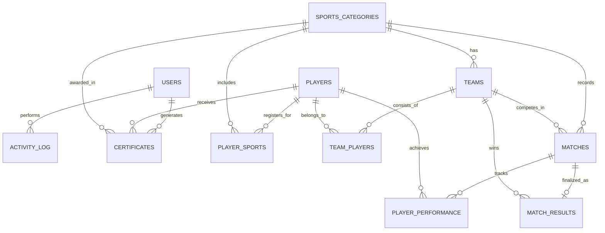
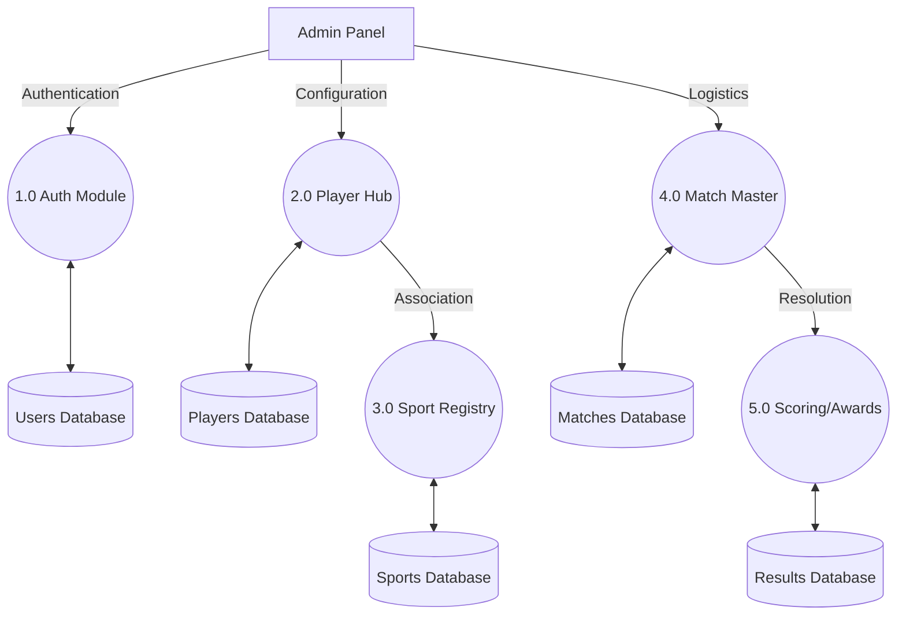
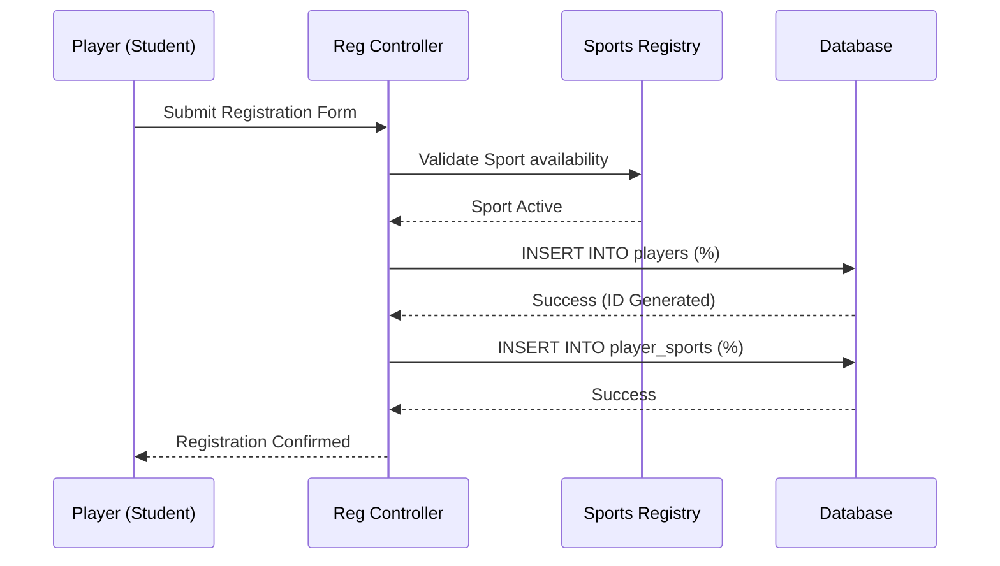

# College Sports Management System

<div align="center">
  
  <h2>College Sports Management System (CSMS)</h2>
  <p><b>Master Technical Report: <a href="docs/COMPLETE_PROJECT_REPORT.md">COMPLETE_PROJECT_REPORT.md</a></b></p>
  <p>A fully offline-ready, role-based sports management ERP for colleges.</p>
</div>

---

## Table of Contents

1. [Overview](#overview)
2. [Problem Statement & Objectives](#problem-statement--objectives)
3. [Tech Stack](#tech-stack)
4. [Core Features & Modules](#core-features--modules)
5. [System Architecture](#system-architecture)
6. [Data Model – ER Diagram](#data-model--er-diagram)
7. [Data Flow – DFD Level 1](#data-flow--dfd-level-1)
8. [System Workflow – Match Finalization](#system-workflow--match-finalization)
9. [User Flow – Player Registration](#user-flow--player-registration)
10. [Installation & Setup](#installation--setup)
11. [Usage Overview](#usage-overview)
12. [Security Highlights](#security-highlights)
13. [Testing & Quality](#testing--quality)
14. [Roadmap & Future Enhancements](#roadmap--future-enhancements)
15. [Developer](#developer)
16. [License](#license)

---

## Overview

The **College Sports Management System (CSMS)** is a production-ready, web-based platform that digitizes the complete operational lifecycle of a college Physical Education Department. It centralizes player registration, sports catalog management, team formation, match scheduling, scoring, certificate generation, and audit logging into a single, secure application deployed on the institutional intranet.

The system is designed to be:

- **Offline-first** for campus networks (no external internet required for core flows).
- **Role-based** with clearly separated Admin and Staff experiences.
- **Data-consistent** through a normalized relational schema and ACID-compliant transactions.

---

## Problem Statement & Objectives

### Problem Statement

Traditional sports administration in colleges relies heavily on **paper registers**, **spreadsheets**, and **notice boards**, which leads to:

- Fragmented player records and poor long-term tracking.
- Manual team formation and error-prone data entry.
- Scheduling conflicts across venues and time slots.
- Delayed announcement of results and certificates.
- Lack of centralized analytics and institutional visibility.

### Objectives

CSMS addresses these gaps with the following objectives:

- **Centralize** all sports data (players, teams, matches, results, certificates) in a unified system.
- **Automate** high-friction tasks such as team formation, match scheduling, and certificate generation.
- **Enforce** role-based access control and institutional audit logging.
- **Ensure** offline-ready operations within the college network.

---

## Tech Stack

- **Web Server**: Apache HTTP Server 2.4+
- **Backend**: PHP 8.x (procedural + modular structure)
- **Database**: MySQL 5.7+ / MariaDB 10.4+ (InnoDB, UTF8MB4)
- **Frontend**: HTML5, CSS3 (Grid/Flexbox), JavaScript (ES6+)
- **Local Stack**: XAMPP / WAMP / LAMP
- **Version Control**: Git

---

## Core Features & Modules

- **User Management**
  - Admin/Staff roles with granular permissions.
  - Secure authentication, session management, and activity logging.

- **Sports Catalog Management**
  - Master registry of 100+ sports disciplines.
  - Per-sport metadata: type (team/individual/both), min/max players, icon/emoji, status.

- **Player Registry**
  - Detailed student-athlete profiles (academic, demographic, medical).
  - Many-to-many mapping between players and sports with primary sport and position.

- **Team & Roster Management**
  - Team creation per sport with coach assignment and optional logo.
  - Roster management with captain designation and statistics.

- **Match Scheduling & Operations**
  - Conflict-aware fixture creation with sport, teams, venue, date, time.
  - Status lifecycle: scheduled → completed → (optional) cancelled.
  - Calendar and list views for upcoming and historical fixtures.

- **Scoring, Results & Performance**
  - Score entry screens for Admin/Staff.
  - Winner/draw computation and result logging.
  - Cross-sport player performance tracking (goals, runs, points, cards, etc.).

- **Certificate Engine**
  - Automated generation of participation and achievement certificates.
  - Persistent logging for reprint and audit reference.

- **Analytics & Reporting**
  - Dashboard KPIs (players, teams, sports, matches).
  - Summary and detailed reports for institutional decision-making.

For a complete module and table specification, refer to `docs/COMPLETE_PROJECT_REPORT.md`.

---

## System Architecture

High-level directory structure:

```text
COLLEGE-SPORTS-MANAGEMENT-SYSTEM/
├── admin/                  # Administrative interface and control logic
├── staff/                  # Staff dashboards and match operations
├── api/                    # JSON endpoints for dashboards, search, and async data
├── assets/                 # Styles, scripts, images, uploads, screenshots
├── database/               # SQL schema and seed data (sports_management.sql)
├── docs/                   # Project documentation and report
│   ├── user/               # End-user manuals and operating guides
│   ├── technical/          # Technical blueprints, ERDs, DFD analysis
│   └── COMPLETE_PROJECT_REPORT.md  # Master technical report
├── includes/               # Shared layouts and helper utilities
├── config.php              # Database connection and global configuration
├── index.php               # Authentication entry point
└── README.md               # This file
```

---

## Data Model – ER Diagram

The CSMS database is built around an 11-table relational schema (3NF) with strong referential integrity.



---

## Data Flow – DFD Level 1

High-level data paths between core modules and persistence layers:



---

## System Workflow – Match Finalization

Decision logic for finalizing match results and issuing certificates:


---

## User Flow – Player Registration

End-to-end flow for student player onboarding and sport allocation:



---

## Installation & Setup

### Prerequisites

- XAMPP / WAMP / LAMP environment
- Apache 2.4+
- PHP 8.x
- MySQL 5.7+ / MariaDB 10.4+

### 1. Clone the Repository

```bash
git clone https://github.com/iBOYJAI/COLLEGE-SPORTS-MANAGEMENT-SYSTEM.git
cd COLLEGE-SPORTS-MANAGEMENT-SYSTEM
```

Place the folder inside your web root (e.g., `htdocs` for XAMPP).

### 2. Database Setup

1. Open phpMyAdmin (or any MySQL client).
2. Create a database named `sports_management`.
3. Import `database/sports_management.sql` into this database.

### 3. Configuration

Update `config.php` with your local database credentials if needed:

```php
$db_host = 'localhost';
$db_name = 'sports_management';
$db_user = 'root';
$db_pass = ''; // or your password
```

### 4. Run the Application

- URL: `http://localhost/COLLEGE-SPORTS-MANAGEMENT-SYSTEM/`
- Default Admin: `admin`
- Default Password: `password`

Change default credentials immediately after first login.

---

## Usage Overview

- **Admin Role**
  - Manage users (Admin/Staff).
  - Configure sports catalog and teams.
  - Oversee player registry, matches, results, and certificates.
  - Access analytics, reports, and audit logs.

- **Staff Role**
  - Register players and manage rosters.
  - Schedule matches (as permitted) and enter scores.
  - Generate participation/achievement certificates.
  - View operational dashboards and reports.

Detailed screen-by-screen documentation is available in the appendices of `docs/COMPLETE_PROJECT_REPORT.md`.

---

## Security Highlights

- Bcrypt password hashing using `password_hash()` and `password_verify()`.
- Role-based authorization checks on all Admin/Staff pages.
- Strict input sanitization and output encoding to prevent SQL Injection and XSS.
- Validated file uploads for avatars and images (extension and size checks).
- Comprehensive audit logging of create/update/delete/login/logout actions.

---

## Testing & Quality

- **Unit Testing**
  - Helper utilities such as `sanitize()`, photo resolvers, age calculation, and icon selection.

- **Integration Testing**
  - Login, player registration, team formation, match scheduling, and certificate generation flows.

- **Validation & UAT**
  - Conflict detection in match scheduling.
  - Unique constraints on usernames and register numbers.
  - User Acceptance Testing with representative Admin and Staff users.

For detailed test cases and methodology, see the testing chapter in `docs/COMPLETE_PROJECT_REPORT.md`.

---

## Roadmap & Future Enhancements

- QR-based public certificate verification portal.
- Mobile-optimized live scoring interface.
- Notification layer for key events (e.g., SMS/Email).
- Advanced analytics (AI/ML-driven talent and performance insights).
- Student self-service portal with personal dashboards.

---

## Developer

**Jaiganesh D. (iBOY)**  
*Founder of [iBOY Innovation HUB](https://github.com/iBOYJAI/)*

Jaiganesh D. (iBOY) leads iBOY Innovation HUB, focusing on AI-powered SaaS platforms, automation tools, and scalable digital systems. He specializes in full-stack development, backend architecture, and AI integration for real-world products.

- **Official Email**: [iboy.innovationhub@gmail.com](mailto:iboy.innovationhub@gmail.com)  
- **GitHub**: [https://github.com/iBOYJAI/](https://github.com/iBOYJAI/)

---

## License

This project is licensed under the **MIT License**.  
See the [`LICENSE`](LICENSE) file for full terms and conditions.

<div align="center">
  <br />
  <p><b>Developed by iBOY Innovation HUB</b></p>
  <p><i>Innovation isn't just what you do — it's who YOU are.</i></p>
</div>
