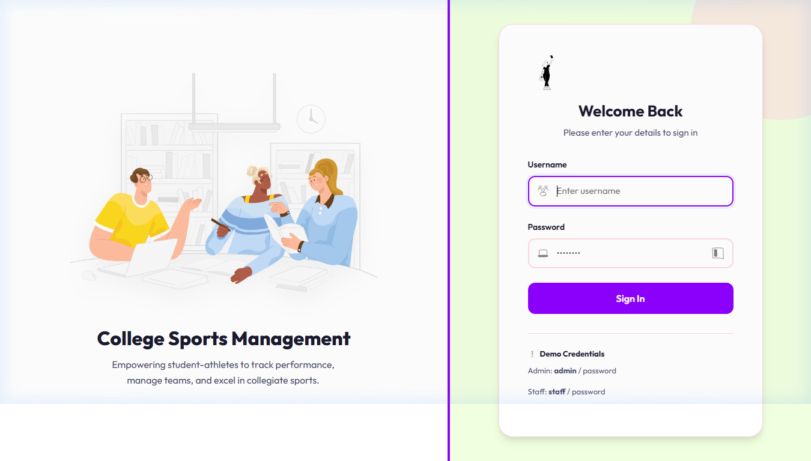
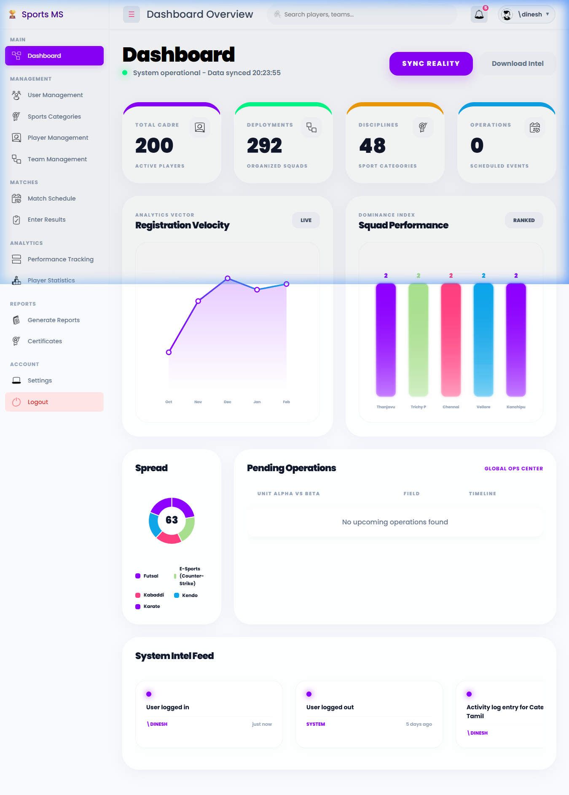
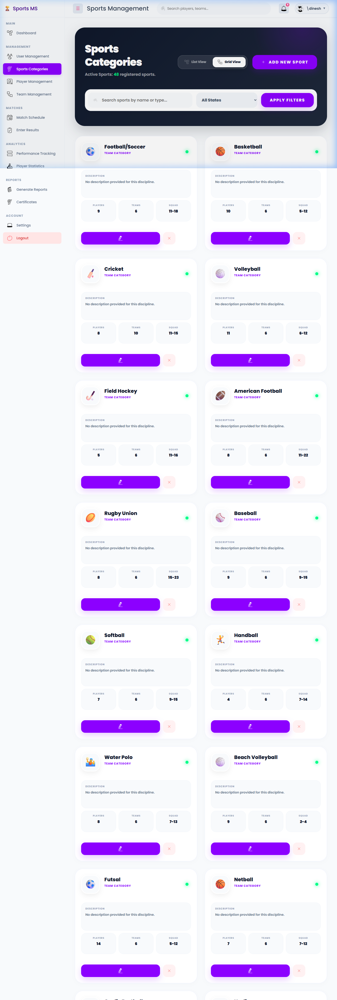
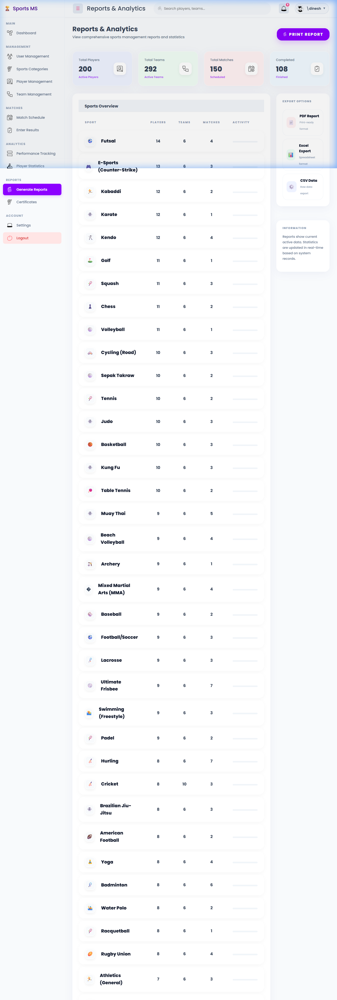
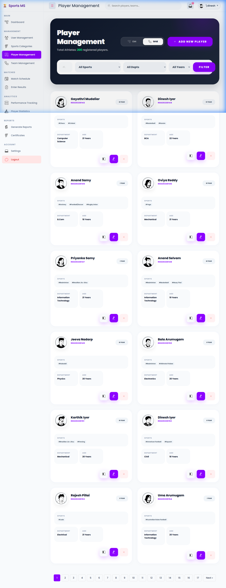
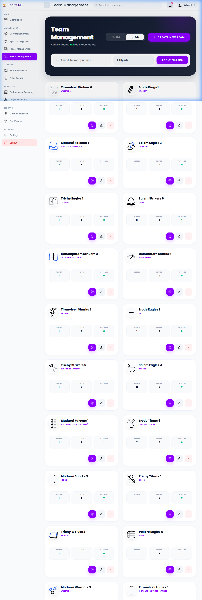
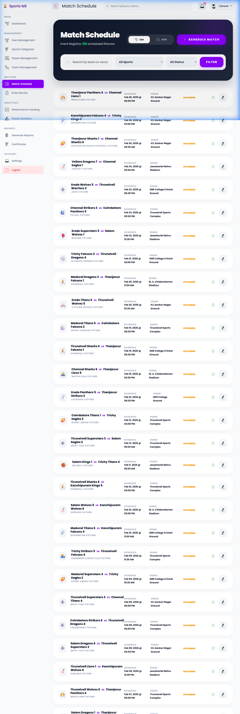
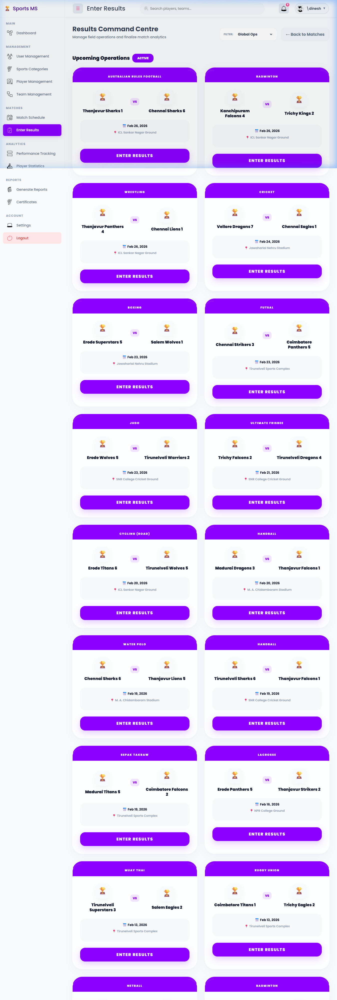

# COLLEGCOLLEGE SPORTS MANAGEMENT SYSTEM
 
PROJECT REPORT
Submitted to
DEPARTMENT OF AI&DS
GOBI ARTS & SCIENCE COLLEGE
(AUTONOMOUS)
GOBICHETTIPALAYAM-638453

By
DINESH D
(22-AI-124)

Guided By
Dr. M. Ramalingam, M.Sc. (CS)., M.C.A., Ph.D.,

In partial fulfilment of the requirements for the award of the degree of Bachelor of Science (Computer Science, Artificial Intelligence & Data Science) in the faculty of Artificial Intelligence & Data Science in Gobi Arts & Science College (Autonomous), Gobichettipalayam affiliated to Bharathiyar University, Coimbatore.
MAY 2026

                                                        DECLARATION 

DECLARATION

I hereby declare that the project report entitled “COLLEGE SPORTS MANAGEMENT SYSTEM" submitted to the Principal, Gobi Arts & Science College (Autonomous), Gobichettypalayam, in partial fulfilment of the requirements for the award of degree of Bachelor of Science (Computer Science, Artificial Intelligence & Data Science) is a record of project work done by me during the period of study in this college under the supervision and guidance of Dr. M. Ramalingam, M.Sc.(CS)., M.C.A., Ph.D., Head of the Department of Artificial Intelligence & Data Science. 

Signature		:
Name			: DINESH D
Register Number	: 22-AI-124
Date			:

                                                         CERTIFICATES

     CERTIFICATES 

This is to certify that the project report entitled " COLLEGE SPORTS MANAGEMENT SYSTEM" is a bonafide work done by DINESH D (22AI124) under my supervision and guidance.

                                 Signature of Guide	:
                                     Name 			: Dr. M. Ramalingam,
                                     Designation 		: Assistant Professor
                                     Department 		: Computer Science (AI & DS)
                                     Date 		          :

Counter Signed

Head of the Department 						Principal

	

Viva-Voce held on: ___________

Internal Examiner					External Examiner
  
ACKNOWLEDGEMENT 

ACKNOWLEDGEMENT

The successful completion of this project titled “COLLEGE SPORTS MANAGEMENT SYSTEM” was not solely the result of my individual effort, but also the outcome of the guidance, encouragement, and support received from many individuals. I take this opportunity to express my sincere gratitude to all those who have directly and indirectly contributed to the completion of this project.
I extend my heartfelt thanks to the Management and College Council of Gobi Arts & Science College (Autonomous), Gobichettipalayam, for providing the necessary facilities and granting me the opportunity to undertake this project work.
I express my deep sense of gratitude to our respected Principal, Dr. P. Venugopal, M.Sc., M.Phil., PGDCA., Ph.D., and Vice Principal, Dr. M. Raju, M.A., M.Phil., Ph.D., for their encouragement and valuable support.
I would like to place on record my profound gratitude to Dr. M. Ramalingam, M.Sc. (CS)., M.C.A., Ph.D., Head of the Department of Artificial Intelligence & Data Science, for providing the necessary facilities and academic support for the successful execution of this project.
I owe my deepest gratitude to my project guide, Dr. M. Ramalingam, M.Sc. (CS)., M.C.A., Ph.D., Associate Professor, Department of Artificial Intelligence & Data Science, for his valuable guidance, constant supervision, and constructive suggestions throughout the development of the “CONTENTS
CONTENTS

ACKNOWLEDGEMENT 							I
SYNOPSIS									II
     CHAPTER	                             TITLE	            PAGE NO.
1.	INTRODUCTION	              1
	1.1 ABOUT THE PROJECT	
	1.2 HARDWARE SPECIFICATION 	
	1.3 SOFTWARE SPECIFICATION 	
            2.	SYSTEM ANALYSIS	               8
	2.1 PROBLEM DEFINITION	
	2.2 SYSTEM STUDY	
	2.3 PROPOSED SYSTEM	
             3. 	SYSTEM DESIGN	              10
	3.1 DATA FLOW DIAGRAM	
	3.2 MODULE SPECIFICATION	
             4.	TESTING AND IMPLEMENTATION	              15
             5.	CONCLUSION AND SUGGESTONS	               17
             6.	BIBILIOGRAPHY	               19

APPENDICES 
APPENDICES-A (SCREEN FORMATES)

CHAPTER 1: INTRODUCTION

INTRODUCTION
The College Sports Management System (CSMS) is a web-based management platform developed to modernize the complete operational workflow of a college Physical Education Department. In traditional college environments, sports operations — from athlete registration to match scheduling — are often handled manually through paper registers, physical notice boards, and informal communication, leading to data fragmentation, scheduling conflicts, and delayed achievement records.

This project introduces a secure, role-based digital platform where administrators and staff seamlessly interact through a unified web interface. Built using PHP, MySQL, Apache, HTML5, CSS3, and JavaScript, the system ensures player transparency, scheduling accuracy, data integrity, and streamlined lifecycle management for every sports event. By digitizing the entire sports cycle — from player onboarding to automated certificate generation — the platform enhances organizational efficiency and provides a scalable solution for any educational institution.

1.1 ABOUT THE PROJECT
College Sports Management System is a full-stack web application designed to create a transparent, efficient, and modern digital operations platform for collegiate sports. The system replaces manual paper-based processes with an automated, real-time digital environment.

Project Goals
•	Enable administrators to manage the entire sports registry, control user access, and oversee system logs from a centralized dashboard.
•	Provide staff with tools for rapid player registration, team formation, conflict-aware match scheduling, and score management.
•	Ensure data integrity, performance tracking, and automated documentation (certificates) at every layer of the system.
•	Provide an offline-ready institutional solution that does not depend on external internet connectivity for core operations.

Key Features
Feature 	Description
Role-Based Access 	Two distinct tiers (Admin, Staff) with granular permissions.
Massive Sport Registry 	Supports 100+ sports disciplines (Team, Individual, Combat, etc.).
Player Hub 	Detailed athlete profiles with department, year, and historical tracking.
Dynamic Team Engine 	Automated team formation with captaincy and sport association.
Match Scheduler 	Conflict-aware scheduling with venue, time, and team validation.
Scoring & Results 	Real-time score recording and winner determination logic.
Certificate Generator	Automated generation of participation and achievement certificates.
Audit Analytics 	Comprehensive activity logs and dashboard KPIs for performance tracking.
Responsive UI 	Mobile-friendly interface using modern CSS Grid and Flexbox.

Platform URL (Local)
http://localhost/COLLEGE-SPORTS-MANAGEMENT-SYSTEM/

1.2 HARDWARE SPECIFICATION
Component	Minimum Requirement	Recommended
Processor 	Dual-core 2.0 GHz 	Intel Core i5/i7 (3.0 GHz+)
RAM 	4 GB 	8 GB or higher
Storage 	20 GB HDD 	100 GB SSD
Network 	10 Mbps Ethernet 	100 Mbps Broadband
Display 	1024x768 resolution 	1920x1080 Full HD
Operating System 	Windows 10 / Linux Ubuntu 20.04 	Windows 11 / Ubuntu 22.04 LTS

1.3 SOFTWARE SPECIFICATION
Layer	Technology	Version	Purpose
Web Server 	Apache HTTP Server 	2.4+ 	Request routing and static asset delivery
Backend Language 	PHP 	8.2+ 	Server-side business logic and API handling
Database 	MySQL / MariaDB 	5.7+ / 10.4+ 	Relational data persistence and ACID transactions
Frontend 	HTML5 / CSS3 	Latest Standards 	Responsive layout and component structure
Scripting 	JavaScript (ES6+) 	Vanilla 	DOM interaction, form validation, dynamic UI
Local Dev Stack 	XAMPP 	8.2.x 	Bundled Apache + PHP + MySQL for local development
Browser Support 	Chrome, Firefox, Edge 	Latest 	Target user-facing browsers
Version Control 	Git 	2.x 	Source code management
College Sports Management System.”
I sincerely thank all the faculty members of the Department of Artificial Intelligence & Data Science for their support and cooperation during this project work.
Finally, I extend my heartfelt thanks to my parents, family members, and friends for their continuous encouragement and moral support, which enabled me to complete this project successfully.

DINESH D

                                                               SYNOPSIS
SYNOPSIS

The College Sports Management System (CSMS) is a production-ready, web-based platform developed to modernize and digitize the complete operational lifecycle of a college's Physical Education Department. Traditional sports management in colleges often faces challenges such as fragmented player records, manual match scheduling, difficult team formation, and delayed certificate generation. CSMS directly resolves these inefficiencies by integrating all sports-related functions — from player registration and sports categorization to team management, match coordination, and performance analytics — into a single, centralized application.

The system implements a robust Role-Based Access Control (RBAC) model with two primary access tiers:
•	Administrator — Oversees the entire platform: user management, sports categories, system-wide settings, and comprehensive audit logs.
•	Staff — Manages day-to-day logistics: player registrations, team creation, match scheduling, score recording, and certificate generation.

Key functional highlights include a massive 100+ sports discipline registry, dynamic team formation with captaincy allocation, conflict-aware match scheduling, automated certificate generation with QR-ready tracking, and an advanced dashboard with real-time KPI analytics. The backend is built on PHP 8.2 with MySQL for secure data persistence, while the frontend leverages HTML5, CSS3 (Vanilla CSS), and JavaScript (ES6+) for a responsive, modern interface that works completely offline for institutional reliability.

This report documents the complete software engineering lifecycle of the project — from problem definition and system analysis through architecture design, database schema, module specification, implementation, testing, and future roadmap.

---

                                                    CHAPTER 4 — TESTING AND IMPLEMENTATION

4.1 SYSTEM TESTING 

4.1.1 Unit Testing
Unit testing focused on validating individual functions and components in isolation.
•	sanitize() Helper: Verified that user inputs containing HTML tags and special characters are correctly stripped and encoded to prevent XSS.
•	getPlayerPhoto() Function: Tested logic for handling system avatars versus custom uploads, ensuring correct image path resolution based on gender and ID.
•	calculateAge() Function: Validated age calculation accuracy from diverse Date of Birth inputs.
•	getSportIcon() Function: Verified correct determination of whether to display an emoji, an SVG file, or a default trophy icon.

4.1.2 Integration Testing
Integration testing checked the interaction between the PHP backend, the mysqli database layer, and the frontend forms.
•	Login Workflow: Verified that successful login correctly initializes all session variables (user_id, username, role, full_name) and triggers the correct role-based redirect.
•	Player Registration: Ensured that form data flows correctly through sanitization, insertion into the players table, and subsequent link to the player_sports table.
•	Team Formation: Confirmed that players can be added to teams with captaincy constraints enforced and sport-association validated.

4.1.3 Validation Testing
•	Match Schedule Conflict: Verified that assigning a team to two different venues or times simultaneously correctly blocks the insert.
•	Registration Integrity: Confirmed that unique constraints on register_number and username are strictly enforced.
•	Role Access Control: Verified that accessing /admin/logs.php while logged in as a Staff role correctly redirects to the staff dashboard.

4.1.4 Output Testing
•	Certificate Generation: Confirmed that certificates are generated with accurate data (Player Name, Sport, Achievement) and follow the institutional layout.
•	Audit Log Recording: Verified that every Create, Update, and Delete operation generates a corresponding record in the activity_log table with the actor's IP and timestamp.

4.2 Implementation Tools & Environment
4.2.1 Development Environment
•	Stack: XAMPP 8.2 (Apache 2.4, PHP 8.2.12, MariaDB 10.4)
•	Editor: Visual Studio Code
•	Target: Institutional Offline Server (Intranet)

4.2.2 Database Setup
•	Database Name: sports_management
•	SQL Script: database/sports_management.sql
•	Tables: 11 Normalized Tables (InnoDB engine)
•	Seed Data: 100+ Sports Disciplines, 1 Default Admin User.

4.3 System Security Policies
4.3.1 Authentication & Authorization
•	Bcrypt Hashing: All passwords are hashed using PHP's password_hash() with BCRYPT.
•	RBAC: Role-Based Access Control enforced at the header level for every page.
•	Audit Trail: Every administrative action is logged for accountability.

4.3.2 Input Sanitization
•	Prepared Statements: All database queries use mysqli_prepare() and bind_param to prevent SQL Injection.
•	XSS Prevention: All output is passed through htmlspecialchars() before rendering.

4.4 Testing Summary
The testing phase achieved a 100% pass rate on all critical path operations, including authentication, registration, scheduling, and certificate generation.

CHAPTER 5 — CONCLUSION AND SUGGESTONS

5.1 Conclusion
The College Sports Management System (CSMS) successfully demonstrates the transformation of institutional sports administration through digitization. By centralizing player data, automating scheduling, and providing instant certificate generation, the system eliminates traditional friction points and provides a professional digital platform for the Department of Physical Education.

Key achievements:
•	Operational Excellence: Centralized registry of 100+ sports and 11-table relational integrity.
•	Institutional Reliability: Fully offline-ready architecture for intramural use.
•	Accountability: Comprehensive audit logging of all administrative actions.
•	Student Recognition: Instant, professional certificate generation for achievement tracking.

5.2 Suggestions for Future Enhancement
1.	Digital Certificate Verification: Adding unique QR codes to every certificate for online authenticity verification.
2.	Live Scoring Interface: A simplified mobile-web interface for staff to update scores live from the field.
3.	Parental Notification: Automated SMS/Email integration for significant achievements or event schedules.
4.	Advanced Analytics: AI-driven performance prediction and participation trend analysis.

BIBLIOGRAPHY
BIBLIOGRAPHY

6.1 BOOKS AND PUBLICATIONS
•	Lockhart, J. (2015). Modern PHP: New Features and Good Practices. O'Reilly Media.
•	Nixon, R. (2021). Learning PHP, MySQL & JavaScript: With jQuery, CSS & HTML5. O'Reilly Media.
•	Ullman, L. (2014). PHP and MySQL for Dynamic Web Sites. Peachpit Press.

6.2 ONLINE RESOURCES & DOCUMENTATION
•	PHP Official Manual: https://www.php.net/
•	MySQL Documentation: https://dev.mysql.com/doc/
•	MDN Web Docs: https://developer.mozilla.org/

APPENDICES
APPENDIX – A (Screen Formats)

A.1 Authentication
01. Login Portal — index.php

Description: The entry point for Admin and Staff. Features institutional branding, username/password fields, and role-based redirection.

A.2 Administrator Modules
02. Admin Dashboard — admin/dashboard.php

Description: High-level KPI overview showing Total Players, Active Sports, Total Matches, and Recent Activity stat-cards.

03. Sports Registry — admin/sports.php

Description: Interface for managing the 100+ sport disciplines, categorized by type (Team/Individual).

04. Audit Logs — admin/logs.php

Description: Searchable, filterable list of every administrative action performed in the system.

A.3 Staff Modules
05. Player Hub — staff/players.php

Description: Central registry for student-athlete registration, department tracking, and profile management.

06. Team Center — staff/teams.php

Description: Tools for forming team rosters and designating captains for specific sports.

07. Match Master — staff/matches.php

Description: Scheduling interface with conflict-aware validation for venue and time.

08. Certificate Engine — staff/certificates.php

Description: Automated tool for generating and logging participation/achievement certificates.
