# COLLEGE SPORTS MANAGEMENT SYSTEM
 
PROJECT REPORT
Submitted to
DEPARTMENT OF AI&DS
GOBI ARTS & SCIENCE COLLEGE
(AUTONOMOUS)
GOBICHETTIPALAYAM-638453

By
DINESH D
(22-AI-124)

Guided By
Dr. M. Ramalingam, M.Sc. (CS)., M.C.A., Ph.D.,

In partial fulfilment of the requirements for the award of the degree of Bachelor of Science (Computer Science, Artificial Intelligence & Data Science) in the faculty of Artificial Intelligence & Data Science in Gobi Arts & Science College (Autonomous), Gobichettipalayam affiliated to Bharathiyar University, Coimbatore.
MAY 2026

                                                        DECLARATION 

DECLARATION

I hereby declare that the project report entitled “COLLEGE SPORTS MANAGEMENT SYSTEM" submitted to the Principal, Gobi Arts & Science College (Autonomous), Gobichettypalayam, in partial fulfilment of the requirements for the award of degree of Bachelor of Science (Computer Science, Artificial Intelligence & Data Science) is a record of project work done by me during the period of study in this college under the supervision and guidance of Dr. M. Ramalingam, M.Sc.(CS)., M.C.A., Ph.D., Head of the Department of Artificial Intelligence & Data Science. 

Signature		:
Name			: DINESH D
Register Number	: 22-AI-124
Date			:

                                                         CERTIFICATES

     CERTIFICATES 

This is to certify that the project report entitled " COLLEGE SPORTS MANAGEMENT SYSTEM" is a bonafide work done by DINESH D (22AI124) under my supervision and guidance.

                                 Signature of Guide	:
                                     Name 			: Dr. M. Ramalingam,
                                     Designation 		: Assistant Professor
                                     Department 		: Computer Science (AI & DS)
                                     Date 		          :

Counter Signed

Head of the Department 						Principal

	

Viva-Voce held on: ___________

Internal Examiner					External Examiner
  
ACKNOWLEDGEMENT 

The successful completion of this project titled “COLLEGE SPORTS MANAGEMENT SYSTEM” was not solely the result of my individual effort but also the outcome of the guidance encouragement and support received from many individuals. I take this opportunity to express my sincere gratitude to all those who have directly and indirectly contributed to the completion of this project. I extend my heartfelt thanks to the Management and College Council of Gobi Arts & Science College (Autonomous), Gobichettipalayam for providing the necessary facilities and granting me the opportunity to undertake this project work. I express my deep sense of gratitude to our respected Principal, Dr. P. Venugopal, M.Sc., M.Phil., PGDCA., Ph.D., and Vice Principal, Dr. M. Raju, M.A., M.Phil., Ph.D., for their encouragement and valuable support. I would like to place on record my profound gratitude to Dr. M. Ramalingam, M.Sc. (CS)., M.C.A., Ph.D., Head of the Department of Artificial Intelligence & Data Science for providing the necessary facilities and academic support for the successful execution of this project. I owe my deepest gratitude to my project guide, Dr. M. Ramalingam, M.Sc. (CS)., M.C.A., Ph.D., Associate Professor, Department of Artificial Intelligence & Data Science for his valuable guidance constant supervision and constructive suggestions throughout the development of the College Sports Management System. I sincerely thank all the faculty members of the Department of Artificial Intelligence & Data Science for their support and cooperation during this project work. Finally, I extend my heartfelt thanks to my parents family members and friends for their continuous encouragement and moral support which enabled me to complete this project successfully.

SYNOPSIS

The College Sports Management System is a production ready web based platform developed to modernize and digitize the complete operational lifecycle of a college Physical Education Department. Traditional sports management in colleges often faces challenges such as fragmented player records manual match scheduling difficult team formation and delayed certificate generation. This system directly resolves these inefficiencies by integrating all sports related functions from player registration and sports categorization to team management match coordination and performance analytics into a single centralized application. The system implements a robust Role Based Access Control model with two primary access tiers where the administrator oversees the entire platform and the staff manages day to day logistics. Key functional highlights include a massive sports discipline registry dynamic team formation with captaincy allocation conflict aware match scheduling automated certificate generation with tracking and an advanced dashboard with real time KPI analytics. The backend is built on PHP 8.2 with MySQL for secure data persistence while the frontend leverages HTML5 CSS3 and JavaScript for a responsive modern interface that works completely offline for institutional reliability.

CHAPTER TITLE PAGE NO.

ACKNOWLEDGEMENT I
SYNOPSIS II

1 INTRODUCTION 07
1.1 About the Project 07
1.2 Hardware Specifications 09
1.3 Software Specifications 09

2 SYSTEM ANALYSIS 11
2.1 Problem Definition 11
2.2 System Study 12
2.3 Proposed System 13

3 SYSTEM DESIGN 15
3.1 Data Flow Diagram (DFD) 15
3.2 Entity Relationship Diagram 16
3.3 File Specifications 17
3.4 Module Specifications 28

4 TESTING AND IMPLEMENTATION 31
4.1 System Testing 31
4.2 Implementation 34

5 CONCLUSION AND SUGGESTIONS 37
5.1 Conclusion 37
5.2 Suggestions for Future Enhancement 37

BIBLIOGRAPHY 39

APPENDICES 41
APPENDIX – A (SCREEN FORMATS) 41
A.1 Authentication Pages 41
A.2 Admin Dashboard and Users 42
A.3 Sports and Teams 44
A.4 Players and Matches 46
APPENDIX – B (REPORT FORMS) 48
Report 1: Tournament Analytics 48
Report 2: Performance Tracking 49
Report 3: Participation Data 50
Report 4: Athlete Statistics 51

CHAPTER 1: INTRODUCTION

1.1 About the Project

The College Sports Management System is a web based management platform developed to modernize the complete operational workflow of a college Physical Education Department. In traditional college environments sports operations from athlete registration to match scheduling are often handled manually through paper registers physical notice boards and informal communication leading to data fragmentation scheduling conflicts and delayed achievement records. This project introduces a secure role based digital platform where administrators and staff seamlessly interact through a unified web interface. Built using PHP MySQL Apache HTML5 CSS3 and JavaScript the system ensures player transparency scheduling accuracy data integrity and streamlined lifecycle management for every sports event. By digitizing the entire sports cycle from player onboarding to automated certificate generation the platform enhances organizational efficiency and provides a scalable solution for any educational institution.

Objectives of the Project

The primary objectives of the College Sports Management System are to centralize all student athlete information into a secure digital registry and automate the complex process of team formation and match scheduling. The system aims to eliminate redundant data entry and manual calculation of sports statistics while providing staff with real time tools for performance tracking. Another major objective is to streamline the issuance of participation and achievement certificates through an automated generator that maintains historical logs for every event. The system is designed to provide institutional oversight through a comprehensive audit trail and analytics dashboard that tracks participation trends across different departments and sports disciplines throughout the academic year.

Scope of the Project

The scope of the project covers the entire operational lifecycle of sports activities within a college campus. It includes role based management for administrators and staff members to handle sports categorization player registrations team rosters and match fixtures. The system supports the recording of match results and individual player performance across various disciplines including team sports and individual events. It facilitates the generation of digital certificates and maintains a structured database of all historical sports data. The project is designed to operate on a local intranet environment ensuring that institutional data remains secure and accessible even without external internet connectivity. While focusing on core administrative workflows the system provides a scalable foundation that can be extended with mobile interfaces or public portals in future iterations.

1.2 Hardware Specifications

The system requires a minimum hardware configuration to ensure smooth operation within the college environment. The processor should be a dual core 2.0 GHz or Intel Core i5/i7 for optimal performance. A minimum of 4 GB RAM is required although 8 GB or higher is recommended for faster processing. Storage requirements include at least 20 GB of HDD space with 100 GB SSD recommended for quicker data access. Network connectivity should be via 10 Mbps Ethernet or 100 Mbps broadband. The display should support a minimum resolution of 1024x768 with 1920x1080 Full HD being the preferred choice for a better user experience. The operating system can be Windows 10 or Linux Ubuntu 20.04 with Windows 11 or Ubuntu 22.04 LTS being recommended for the latest security patches.

1.3 Software Specifications

The application is built using a modern full stack web development environment utilizing VS Code as the primary integrated development environment. The web server layer utilizes Apache HTTP Server 2.4 or higher for request routing and static asset delivery. The backend logic is implemented using PHP 8.2 or higher for server side business processes and API handling. Data persistence is managed by MySQL or MariaDB with versions 5.7 or 10.4 and above ensuring relational data integrity and ACID transactions. The frontend is structured using HTML5 and styled with CSS3 following the latest design standards for a responsive layout. Client side interaction form validation and dynamic UI updates are handled by vanilla JavaScript ES6. The local development stack is managed through XAMPP 8.2 which bundles all necessary components including Apache and MariaDB.

CHAPTER 2: SYSTEM ANALYSIS

2.1 Problem Definition

Existing System

The existing system for managing college sports involves manual paper based processes where registrations are collected through physical forms and files. Notice boards are used to display match schedules and spreadsheets are often used for maintaining team lists in a decentralized manner. This manual approach leading to fragmented player records and scheduling conflicts makes it difficult for the physical education department to track the long term achievements of students. Communication between staff and players often happens through informal channels resulting in delays and confusion during large scale tournaments. Performance metrics are recorded in registers that are prone to physical damage and are difficult to search for historical reference.

Limitations of Existing System

The limitations of the existing system include a high risk of data loss due to physical record keeping and a lack of real time visibility into sports activities. Manual scheduling often leads to venue overlaps and timing conflicts because there is no automated clash detection mechanism. Team formation is a time consuming process that requires cross referencing multiple sheets and files. Generating certificates manually for hundreds of participants is repetitive and prone to errors in names and event details. Furthermore there is no centralized dashboard to provide institutional analytics or participation trends making it difficult for the management to make data driven decisions regarding sports infrastructure.

2.2 System Study

Technical Feasibility

The project is technically feasible as the required hardware and software components are readily available within the institution. The use of PHP and MySQL ensures that the system can be hosted on standard local servers using XAMPP or separate Apache installations. The institutional labs are equipped with systems running VS Code and meeting the minimum RAM and storage requirements. Since the system uses standard web technologies like HTML5 and CSS3 it is compatible with all modern web browsers available in the college environment. The simplicity of the tech stack ensures that the system can be maintained by the internal IT staff with minimal specialized training.

Economic Feasibility

The College Sports Management System is highly cost effective as it leverages open source technologies that do not require expensive licensing fees. No additional hardware investment is needed as the system can run on existing institutional infrastructure. The transition from paper based registers to a digital platform reduces the recurring costs of stationery and physical storage space. The automated certificate generation saves significant man hours for the staff allowing them to focus on active coaching and event coordination. The overall investment in development and deployment is minimal compared to the long term operational benefits and data security provided by the digital solution.

Operational Feasibility

The system is operationally feasible because it is designed with a user friendly interface tailored for the college staff and administrators. The role based access ensures that users only see the tools relevant to their responsibilities simplifies the training process. Staff members who are familiar with basic web browsing can quickly learn to register players and enter match scores. The system streamlines the existing workflow rather than complicating it by replacing manual data entry with intuitive digital forms. Positive feedback from the Physical Education Department indicates a strong readiness to adopt the platform as it directly addresses their daily operational pain points.

2.3 Proposed System

Advantages of Proposed System

The proposed system offers several advantages including centralized data management and automated workflows for match scheduling and team formation. By maintaining a single source of truth for all student athlete records the system ensures data consistency across all sports disciplines. It provides instant visibility into upcoming matches and historical results through a real time dashboard. The automated certificate generator reduces the administrative burden and ensures that every deserving player receives professional recognition promptly. Institutional audit logs enhance accountability and allow administrators to track all changes made to the sports registry. The responsive design allows staff to access the system from various devices within the campus network improving coordinates and communication.

CHAPTER 3: SYSTEM DESIGN

3.1 Data Flow Diagram (DFD)

DFD LEVEL 0 — CONTEXT DIAGRAM

The Level 0 Data Flow Diagram also known as the Context Diagram shows the College Sports Management System as a single process interacting with its primary external entities namely the Administrator and the Staff. The Administrator provides user management data and sports configuration while receiving audit logs and analytics reports. The Staff entity provides player registrations team details and match results while receiving schedules and generated certificates. This top level view illustrates the system boundaries and the main inputs and outputs that define its interaction with the users.

DFD LEVEL 1 — MAJOR PROCESSES

The Level 1 Data Flow Diagram breaks down the context diagram into several core processes including User Authentication Player Registration Team Management Match Scheduling and Result Recording. The User Authentication process manages role based access for all users. Player Registration handles the input and storage of athlete profiles in the database. Team Management organizes players into specific sports associations. Match Scheduling coordinates fixtures and venue assignments while preventing conflicts. Result Recording captures scores and determines winners which then triggers the Certificate Engine for automated recognition generation. Each process interacts with the centralized sports management database to ensure data persistence and retrieval.

3.2 Entity Relationship Diagram

The Entity Relationship Diagram conceptualizes the database structure by identifying the core entities and their associations. Key entities include Users Players Sports Categories Teams Matches and Match Results. A one to many relationship exists between Users and Certificates as one staff member can issue many recognition documents. A many to many relationship between Players and Sports is resolved through a mapping table that tracks individual athlete participation. One sport can have many teams and many matches associated with it. Each match is linked to two teams and results in a single match result entry. Team players have a many to many relationship between players and teams allowing athletes to participate in multiple team events while designating captains for each roster.

3.3 File Specifications

The database schema consists of several interconnected tables that ensure detailed record keeping and referential integrity for the sports management system. Each table is designed with specific primary and foreign keys to maintain a normalized data structure.

Table Name: users
Purpose: Stores authentication and profile data for all authorized users.

| Field name | Data type | Size | Constraints | Description |
|------------|-----------|------|-------------|-------------|
| id | Integer | 11 | Primary Key | Unique ID |
| full_name | Varchar | 100 | Not Null | User name |
| username | Varchar | 50 | Unique | Login name |
| email | Varchar | 100 | Unique | Email addr |
| password | Varchar | 255 | Not Null | Hashed pass |
| role | Enum | - | Not Null | User role |
| status | Varchar | 20 | - | Work status |
| photo | Varchar | 255 | - | Avatar path |
| created_at | Timestamp | - | - | Create time |

Table Name: sports_categories
Purpose: Maintains the catalog of all available sports disciplines.

| Field name | Data type | Size | Constraints | Description |
|------------|-----------|------|-------------|-------------|
| id | Integer | 11 | Primary Key | Sport ID |
| sport_name | Varchar | 100 | Unique | Sport title |
| description | Text | - | - | Details |
| icon | Varchar | 255 | - | Emoji/Icon |
| category_type | Varchar | 20 | - | Match type |
| min_players | Integer | 3 | - | Min count |
| max_players | Integer | 3 | - | Max count |
| status | Varchar | 20 | - | Availability |

Table Name: players
Purpose: Stores detailed athlete registrations and profiles.

| Field name | Data type | Size | Constraints | Description |
|------------|-----------|------|-------------|-------------|
| id | Integer | 11 | Primary Key | Player ID |
| name | Varchar | 100 | Not Null | Full name |
| register_number | Varchar | 50 | Unique | College ID |
| dob | Date | - | Not Null | Birth date |
| age | Integer | 3 | - | Years old |
| gender | Varchar | 10 | Not Null | Category |
| department | Varchar | 100 | Not Null | Academic |
| year | Varchar | 10 | Not Null | Study year |
| mobile | Varchar | 15 | Not Null | Contact |
| photo | Varchar | 255 | - | Photo path |
| status | Varchar | 20 | - | Play status |

Table Name: teams
Purpose: Organizes players into formal team entries.

| Field name | Data type | Size | Constraints | Description |
|------------|-----------|------|-------------|-------------|
| id | Integer | 11 | Primary Key | Team ID |
| team_name | Varchar | 100 | Not Null | Unique name |
| sport_id | Integer | 11 | Foreign Key | Linked sport |
| coach_name | Varchar | 100 | - | Coach title |
| matches_played | Integer | 11 | - | Experience |
| matches_won | Integer | 11 | - | Successes |
| logo | Varchar | 255 | - | Emblem path |
| status | Varchar | 20 | - | Team state |

Table Name: matches
Purpose: Records match schedules and venue assignments.

| Field name | Data type | Size | Constraints | Description |
|------------|-----------|------|-------------|-------------|
| id | Integer | 11 | Primary Key | Match ID |
| sport_id | Integer | 11 | Foreign Key | Sport type |
| team1_id | Integer | 11 | Foreign Key | First team |
| team2_id | Integer | 11 | Foreign Key | Second team |
| match_date | Date | - | Not Null | Event date |
| match_time | Time | - | Not Null | Event time |
| venue | Varchar | 255 | Not Null | Ground site |
| status | Varchar | 20 | - | Fixture state |

Table Name: match_results
Purpose: Records scores and winners for finalized matches.

| Field name | Data type | Size | Constraints | Description |
|------------|-----------|------|-------------|-------------|
| id | Integer | 11 | Primary Key | Result ID |
| match_id | Integer | 11 | Foreign Key | Fixture link |
| team1_score | Integer | 11 | - | Score tally |
| team2_score | Integer | 11 | - | Score tally |
| winner_team_id | Integer | 11 | Foreign Key | Victor ID |
| result_status | Varchar | 20 | - | Final state |
| notes | Text | - | - | Summary |

Table Name: certificates
Purpose: Documentation of participation and achievements.

| Field name | Data type | Size | Constraints | Description |
|------------|-----------|------|-------------|-------------|
| id | Integer | 11 | Primary Key | Cert ID |
| player_id | Integer | 11 | Foreign Key | Athlete |
| certificate_type | Varchar | 50 | Not Null | Type label |
| sport_id | Integer | 11 | Foreign Key | Event sport |
| issue_date | Date | - | Not Null | Date given |
| generated_by | Integer | 11 | Foreign Key | Staff ID |

Table Name: activity_log
Purpose: Institutional audit trail for all system actions.

| Field name | Data type | Size | Constraints | Description |
|------------|-----------|------|-------------|-------------|
| id | Integer | 11 | Primary Key | Log ID |
| user_id | Integer | 11 | Foreign Key | Actor ID |
| action_type | Varchar | 50 | Not Null | Event type |
| module | Varchar | 50 | Not Null | Site area |
| record_id | Integer | 11 | - | Affected ID |
| description | Text | - | - | Action info |
| created_at | Timestamp | - | - | Event time |

3.4 Module Specifications

The system architecture is divided into several modules to handle specific administrative and operational tasks. Each module is designed to interact with the core database while providing a seamless user interface for the administrators and staff members.

Modules List:
1. User Authentication and Management
2. Sports Registry and Categorization
3. Player Hub and Enrollment
4. Team Engine and Roster Building
5. Match Scheduler and Venue Coordinator
6. Results and Scoring Processor
7. Certificate Generator and Logger
8. Audit Trail and Analytics

Authentication and Management
This module handles secure login for all users via hashed password verification and role based session initialization. It allows administrators to create and manage staff accounts ensuring that each user has appropriate permissions for their role.

Sports Registry
The registry provides a comprehensive catalog of all sports disciplines offered by the college. It allows administrators to define categories player limits and icons for each sport to ensure organized documentation.

Player Hub
This module manages the registration of student athletes with academic and personal details. It provides search and filter options to quickly find players by their register number or department.

Team Engine
The team engine helps organize registered players into specific sports teams. It allows for the assignment of coaches and captains while tracking the participation history of each team.

Match Scheduler
This coordinator handles the creation of tournament fixtures by assigning teams to specific dates times and venues while ensuring there are no scheduling conflicts.

Results Processor
The processor records match outcomes and individual player statistics after completion. It calculates winners and updates the dashboard with real time results.

Certificate Generator
This automated tool generates professional certificates for players based on their tournament records. It maintains a historical log of all issued documents for verification.

Audit and Analytics
The audit module tracks every action taken within the system from registration to result entry. The analytics panel provides visual insights into participation trends and department successes.

CHAPTER 4: TESTING AND IMPLEMENTATION

4.1 System Testing

Unit Testing
Unit testing was performed on individual components to verify that each function operates correctly in isolation. For example the sanitization helper was tested with various inputs to ensure it correctly escapes special characters and prevents security vulnerabilities.

Integration Testing
Integration testing ensured that different modules work together seamlessly within the system. Tests were conducted to verify that registering a player correctly updates the sports association and that team formation properly references the player registry.

Validation Testing
Validation testing checked that the system enforces business rules correctly. This included verifying that the system prevents duplicate registrations for the same player and restricts scheduling teams for overlapping match times.

Output Testing
Output testing focused on the accuracy of the generated results and reports. This confirmed that the dashboard displays correct counts for athletes and teams and that generated certificates contain the precise data entered into the system.

White Box Testing
White box testing involved inspecting the internal logic and code structures to ensure that every path within the functions is executed correctly. This was done to verify that error handling mechanisms are robust and and reliable.

Black Box Testing
Black box testing was conducted from the user perspective to ensure that all interface elements respond correctly to user actions. It focused on the usability and functional completeness of the system without considering the internal code.

4.2 Implementation

Database Implementation
The database was implemented by executing the structured SQL scripts to create eleven normalized tables in the MariaDB server. Primary and foreign keys were configured to ensure referential integrity across all entities within the sports management system.

Backend Implementation
The backend was implemented using PHP with mysqli extension to interact with the database. Clean and modular code was written to handle business logic while ensuring that all user inputs are sanitized and database queries are prepared securely.

Frontend and AJAX Implementation
The frontend was developed with HTML5 and CSS3 to provide a responsive and professional interface. AJAX was integrated into the dashboard and search features to allow real time data updates without requiring full page reloads improving the overall user experience.

CHAPTER 5: CONCLUSION AND SUGGESTIONS

5.1 Conclusion

The College Sports Management System successfully provides a digital solution for the administrative challenges faced by the Physical Education Department. By centralizing player records and automating match details the system replaces manual errors with digital precision. The institutional audit trail and automated certificate generation ensure a high level of accountability and student recognition. The project demonstrates how institutional workflows can be transformed to improve efficiency and data security within a college environment.

5.2 Suggestions for Future Enhancement

Future enhancements for the system include the following points:
1. Online certificate verification via public QR code scanners.
2. Mobile application for real time field side score updates by referees.
3. Automated email or SMS notifications for tournament wins.
4. AI driven talent scouting based on historical performance data.
5. Student facing portal for viewing personal sports records and achievement history.

BIBLIOGRAPHY

Books References
Lockhart J 2015 Modern PHP New Features and Good Practices O'Reilly Media. Nixon R 2021 Learning PHP MySQL and JavaScript With jQuery CSS and HTML5 O'Reilly Media. Ullman L 2014 PHP and MySQL for Dynamic Web Sites Peachpit Press.

URL References
PHP Official Documentation found at https://www.php.net/. MySQL Reference Manual accessible at https://dev.mysql.com/doc/. MDN Web Docs for Frontend Standards at https://developer.mozilla.org/. W3Schools Web Tutorial for Beginners at https://www.w3schools.com/.

APPENDICES

APPENDIX – A (SCREEN FORMATS)

A.1 Authentication Pages

The authentication portal provides secure role based access for administrators and staff.

A.2 Admin Dashboard and Users
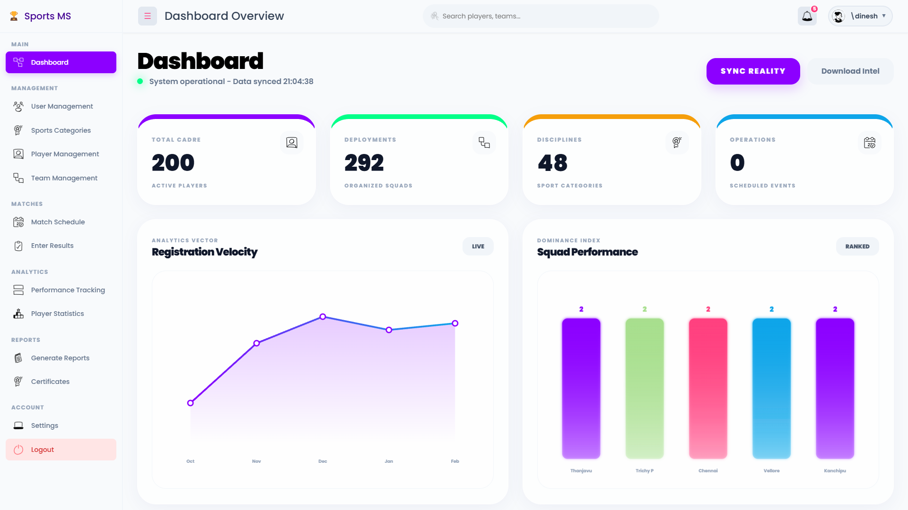
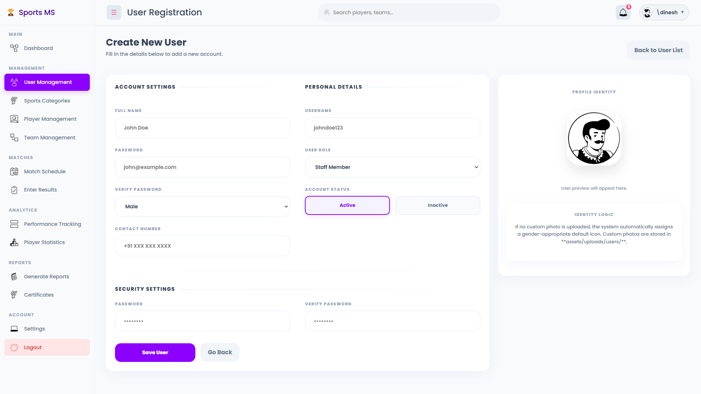
The administrator manages the system through a comprehensive dashboard and user registry.

A.3 Sports and Teams
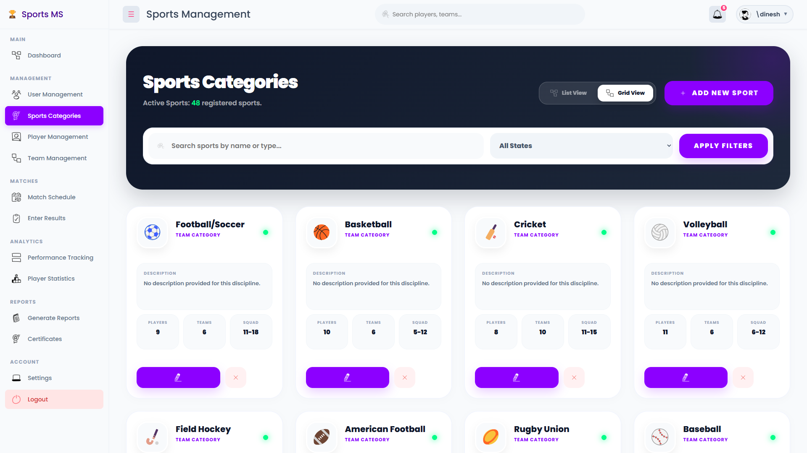
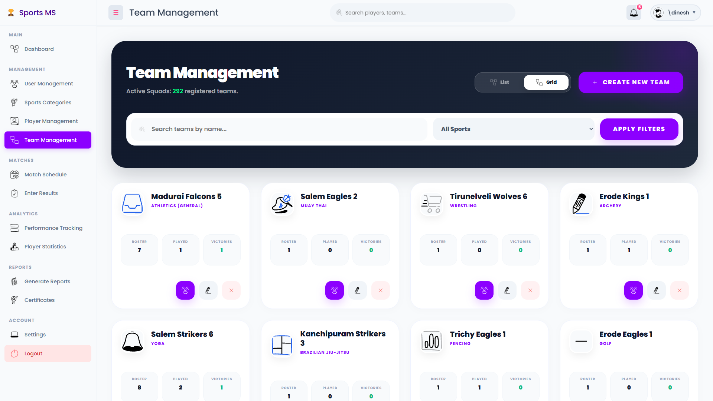
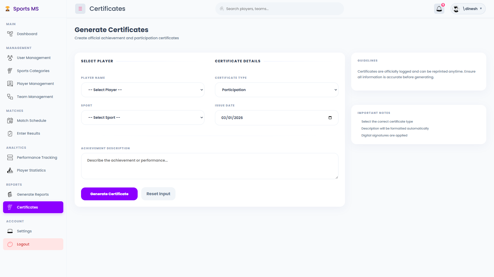
Administrators can configure the sports catalog and organize players into formal teams.

A.4 Players and Matches
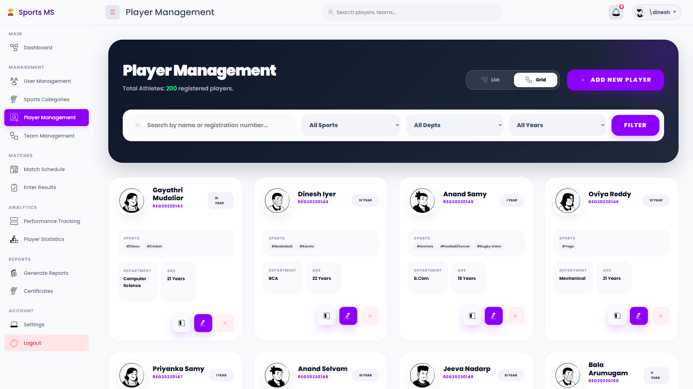
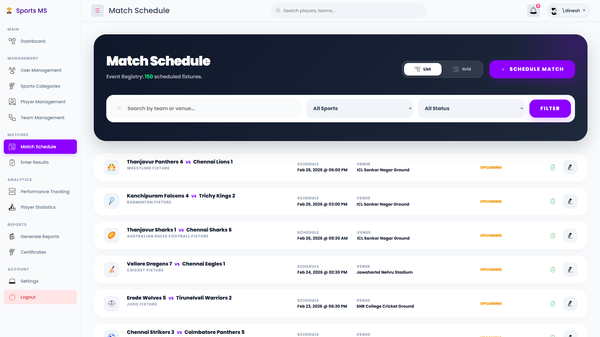
The system tracks player enrollments and schedules sports fixtures across various venues.

APPENDIX – B (REPORT FORMS)

Report 1: Tournament Analytics
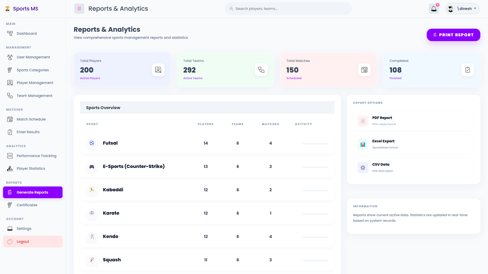

Report 2: Performance Tracking
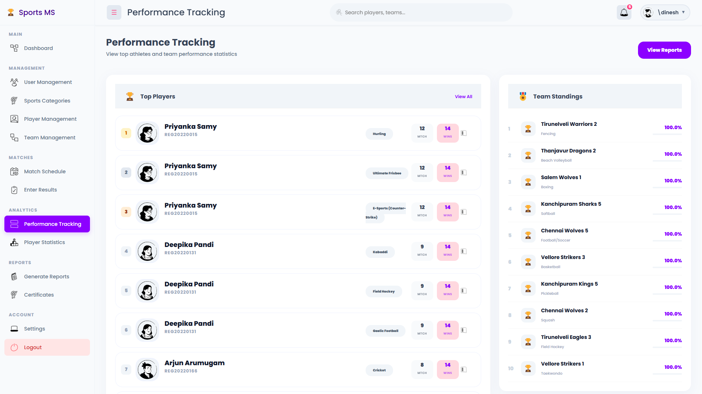

Report 3: Participation Data
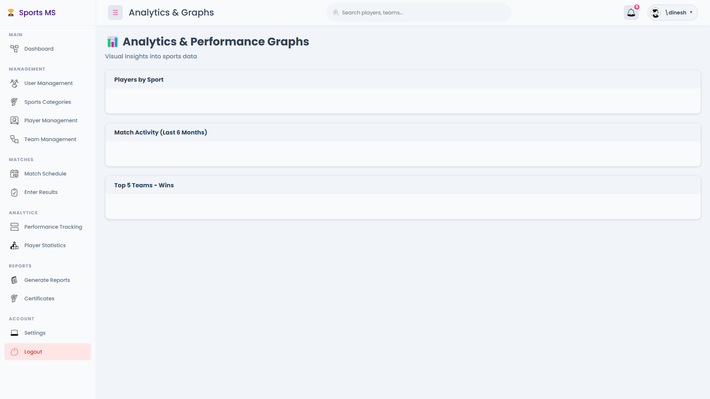

Report 4: Athlete Statistics
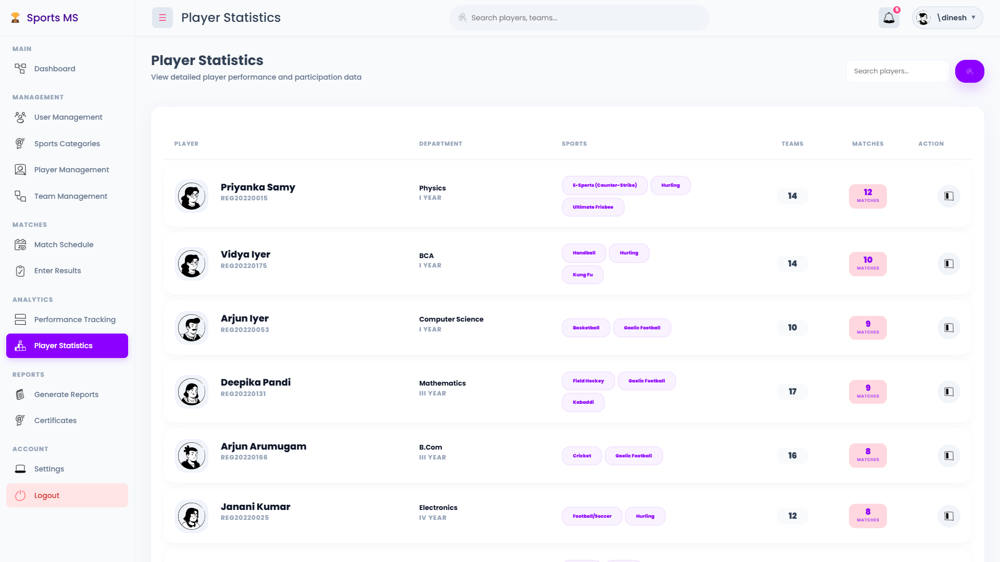
