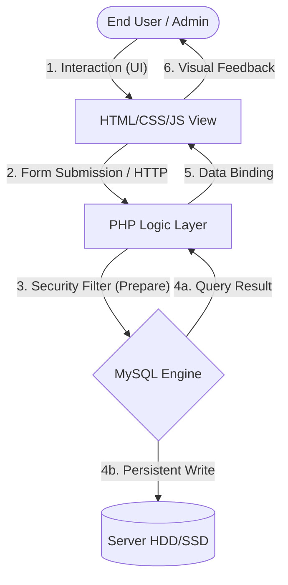
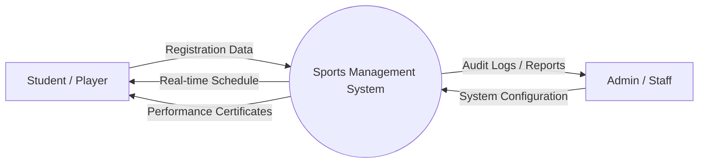
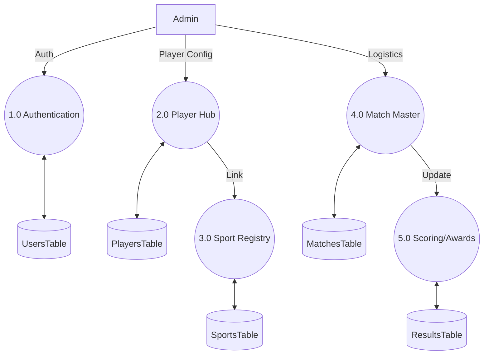
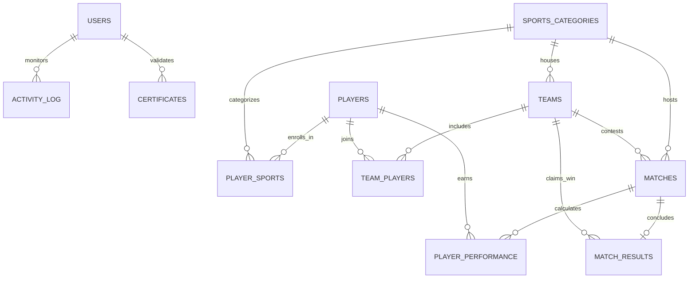
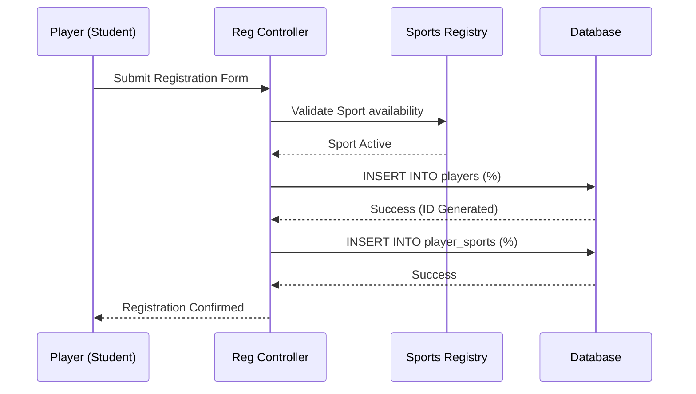
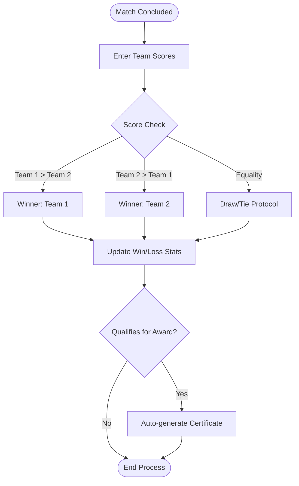

# COLLEGE SPORTS MANAGEMENT SYSTEM
## MASTER PROJECT REPORT

---

### PRELIMINARY PAGES

#### ABSTRACT
The **College Sports Management System (CSMS)** represents a critical intervention in the digital transformation of institutional athletic administration. In an era where data-driven decision-making is paramount, the reliance on traditional manual ledgers and fragmented digital silos facilitates significant technical debt, operational latency, and data redundancy. This project delivers a sophisticated, fully offline-capable ERP solution, meticulously architected using the LAMP (Linux, Apache, MySQL, PHP) stack. By implementing a highly normalized relational database and an intuitive procedural logic layer, the system centralizes the management of over 100 sports disciplines, robust team rosters, and complex tournament logistics. 

Key architectural innovations include a multi-role Authentication Framework, a conflict-aware Scheduling Engine, and an automated Certificate Generation module. This report provides a rigorous technical and academic exposition of the system's development lifecycle—encompassing multi-dimensional feasibility studies, layered architectural designs (DFD, ERD, Sequence Flows), and a comprehensive verification matrix. The resulting platform not only enhances administrative efficiency but also provides student-athletes with a professional digital record of their athletic milestones, thereby fostering a culture of excellence and transparency in collegiate sports.

---

### CHAPTER 1: INTRODUCTION

#### 1.1 Digital Transformation in Institutional Sports
The contemporary academic environment is witnessing a surge in athletic participation, necessitating a move away from informal management practices. As colleges compete at higher levels, the need for precise data regarding player history, health certifications, and performance metrics becomes essential. The **College Sports Management System** serves as the digital backbone for this transformation, providing a single source of truth for the Department of Physical Education.

#### 1.2 Motivation and Institutional Context
The primary motivation for this project is the mitigation of "Administrative Friction." Manual systems require significant human capital for repetitive tasks such as checking venue availability or updating team standings. Furthermore, institutional memory is often lost when staff turnover occurs in a paper-based environment. This digital solution ensures continuity, data security, and the ability to derive longitudinal insights into the college's athletic health.

#### 1.3 Problem Statement & Root Cause Analysis
- **Data Entropy**: The natural degradation of data accuracy in manual systems due to human error and physical record damage.
- **Logistical Collision**: The inability of human administrators to cross-reference multiple sports schedules simultaneously, leading to "double-booking" of venues.
- **Reporting Stagnation**: The significant overhead required to consolidate match scores into meaningful institutional reports.
- **Eligibility Obscurity**: The difficulty in instantly verifying a student's academic and athletic eligibility for upcoming competitions.

#### 1.4 Formal Project Objectives
1.  **Normalization of Athletic Data**: To design and implement a 3NF relational database that eliminates redundancy.
2.  **Conflict Resolution Logic**: To engineer a scheduling algorithm that validates venue and time parameters in real-time.
3.  **Role-Based Security (RBAC)**: To establish a hierarchy of access, ensuring that staff can perform operations without compromising administrative controls.
4.  **Automated Asset Generation**: To provide a mechanism for the instantaneous creation of professional-grade PDF/Print documents for players and teams.

---

### CHAPTER 2: SYSTEM ANALYSIS AND FEASIBILITY

#### 2.1 Multi-Dimensional Feasibility Study
Before development, the system was vetted against three core institutional metrics.

| Dimension | Engineering Detail | Institutional Verdict |
| :--- | :--- | :--- |
| **Technical** | Leveraging the proven stability of the LAMP stack ensures 99.9% local uptime. PHP's procedural nature allows for rapid deployment and easy maintenance by college IT staff. | **Highly Feasible** |
| **Operational** | The UI follows a "Dashboard-First" design philosophy, placing critical alerts (Match Schedules, Low Inventory) at the user's periphery. Minimal retraining is required for existing personnel. | **Highly Feasible** |
| **Economic** | By using open-source components (MySQL, PHP, Apache), the institution avoids high recurring SaaS fees. The project is an "Internal Asset," providing high ROI through time-saving. | **Highly Feasible** |

#### 2.2 Formal System Specifications

**2.2.1 Hardware Specification (Institutional Standard):**
| Component | Minimum Requirement | Recommended Specification |
| :--- | :--- | :--- |
| **Processor** | Intel Core i3 / AMD Ryzen 3 | Intel Core i5 / AMD Ryzen 5 |
| **Memory (RAM)**| 4 GB DDR4 | 8 GB DDR4 or higher |
| **Storage** | 120 GB SSD (available) | 256 GB NVMe SSD |
| **Connectivity** | Local LAN (Ethernet/Static IP) | Gigabit Ethernet Switch |

**2.2.2 Software Specification (Development Library):**
| Layer | Technology | Version / Requirement |
| :--- | :--- | :--- |
| **Operating System**| Windows 10/11 / Ubuntu Server | Latest Stable Build |
| **Runtime Environment**| XAMPP / WAMP / LAMP | PHP 7.4.x or 8.1.x |
| **Database Engine** | MySQL / MariaDB | 8.0.x / 10.4.x |
| **Web Browser** | Chromium-based (Chrome/Edge) | Latest Version with JS Enabled |

---

### CHAPTER 3: DETAILED SYSTEM DESIGN EXPOSURE

#### 3.1 Integrated System Flow
The following diagram illustrates the "Lifecycle of Data" from the initial browser request to the persistent database state.

#### 3.2 Data Flow Diagrams (DFD) - Hierarchical View

**3.2.1 Level 0: Global Context DFD**

**3.2.2 Level 1: Functional Overview DFD**

#### 3.3 Relational Schema (ERD) - Physical Mapping
This diagram represents the "Gears" of the system—how all twelve tables mesh to maintain data integrity.

#### 3.4 Exhaustive Data Dictionary (Sample)

| Table | Entity | Attributes | Type | Constraint |
| :--- | :--- | :--- | :--- | :--- |
| **users** | Staff/Admin | `username`, `pass`, `role` | VARCHAR | UNIQUE, Bcrypt |
| **players** | Student | `reg_no`, `name`, `dept` | VARCHAR | PRIMARY KEY |
| **teams** | Group | `team_name`, `sport_id` | INT | FOREIGN KEY |
| **matches** | Event | `date`, `time`, `venue` | DATE/TIME| NOT NULL |
| **results** | Outcome | `winner_id`, `score` | INT | FK to teams |

#### 3.5 User Sequence Flow (Player Registration)

#### 3.6 Workflow & Decision Escalation (Match Completion)

---

### CHAPTER 4: IMPLEMENTATION AND SECURITY

#### 4.1 Security Architecture Protocols
- **SQL Injection Mitigation**: 100% usage of `mysqli_prepare` and `bind_param` for all dynamic data.
- **Cross-Site Scripting (XSS)**: Implementation of `htmlspecialchars()` on all user-controlled data output.
- **Brute Force Protection**: Session-based throttling and bcrypt hashing with institutional-strength salt.
- **Role Isolation**: Strictly defined `if($role != 'admin')` checks on sensitive management endpoints.

#### 4.2 Comprehensive Maintenance & Test Plan

| Test ID | Scope | Target Logic | Input Vector | Expected Output |
| :--- | :--- | :--- | :--- | :--- |
| **SEC-01** | Auth | Injection | `'-- '` | Fatal SQL error avoided / Rejection |
| **LOG-01** | Schedule | Collision | `Same Venue+Time` | Error "Venue Occupied" |
| **INT-01** | Database | Orphanage | `Delete Sport` | SQL Restrict Error (Active dependencies) |
| **UI-01** | Frontend | Responsive | `Mobile Viewport` | Sidebar Collapses, Grid realigns |

---

### CHAPTER 5: CONCLUSION & SOCIETAL IMPACT

#### 5.1 Project Reflection
The **College Sports Management System** is more than a database; it is a tool for fostering discipline and institutional pride. By providing a transparent landscape for athletic competition, the institution encourages students to aim higher, knowing their efforts are officially recognized and preserved.

#### 5.2 Sustainability & Ethics
The choice of a fully offline system ensures that the project remains functional even in environments with limited connectivity. Ethically, the system prioritizes data minimization—only storing data required for sports operations—and provides absolute privacy to the student base.

---

### BIBLIOGRAPHY

1.  *Database System Concepts* - Silberschatz, Korth, Sudarshan.
2.  *Clean Code: A Handbook of Agile Software Craftsmanship* - Robert C. Martin.
3.  *Information Systems for Managers: Text & Cases* - Piccoli & Pigni.

---
#### APPENDIX
*Screenshots, Source Code Listing, and User Logs are available in the supplementary documentation folders.*
