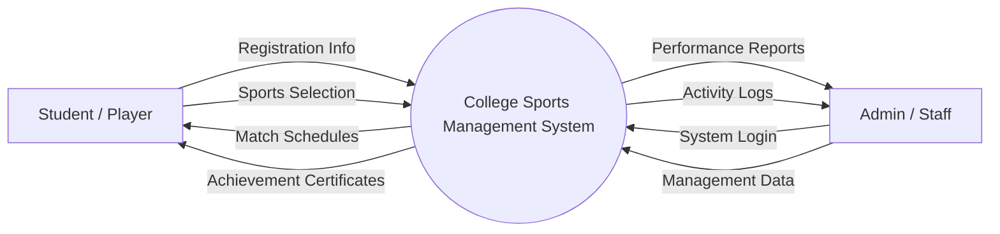
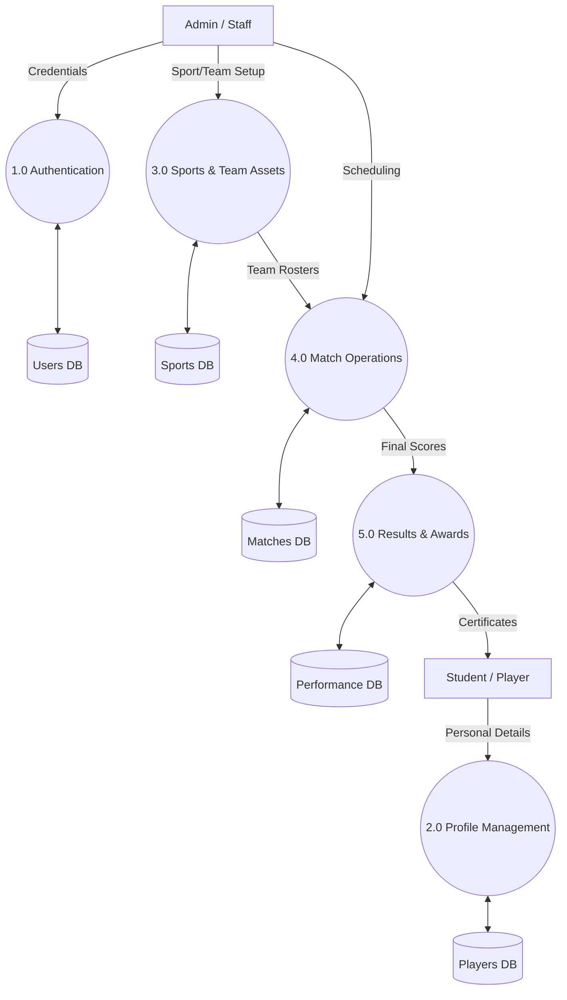
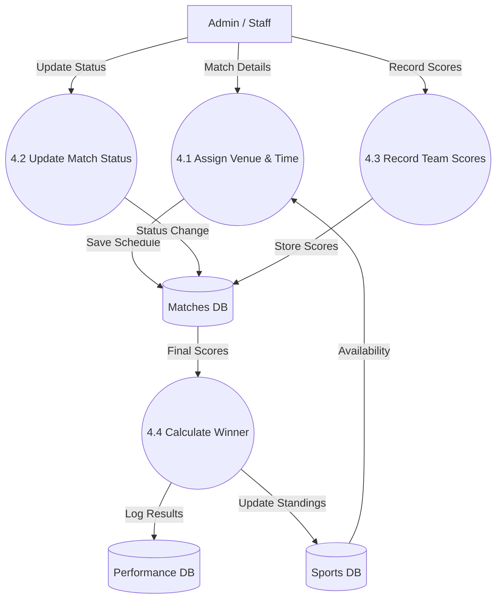

# Data Flow Diagrams (DFD) - College Sports Management System

This document provides a clean and structured representation of data movement within the College Sports Management System.

---

## 🔹 Level 0: Context Diagram
The **Context Diagram** shows the system as a single process and its interactions with external entities.

---

## 🔹 Level 1: System Overview
The **Level 1 DFD** breaks the system into major functional modules and identifies the primary data stores.

---

## 🔹 Level 2: Detailed Match Processing
The **Level 2 DFD** provides a granular view of the **Match Operations (4.0)** process.

---

## 📊 Component Overview

| Component | Type | Description |
| :--- | :--- | :--- |
| **Student** | Entity | Primary user who participates in sports activities. |
| **Admin** | Entity | Authorized personnel managing the sports system. |
| **Processes** | Logic | Circles representing functional transformations of data. |
| **Data Stores** | Storage | Cylinders representing persistent database tables. |
| **Data Flows** | Movement | Arrows representing the direction of information travel. |

---

