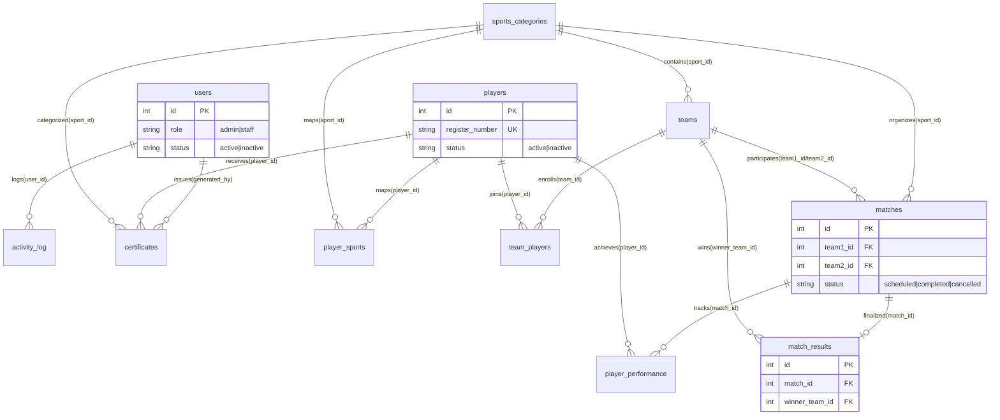
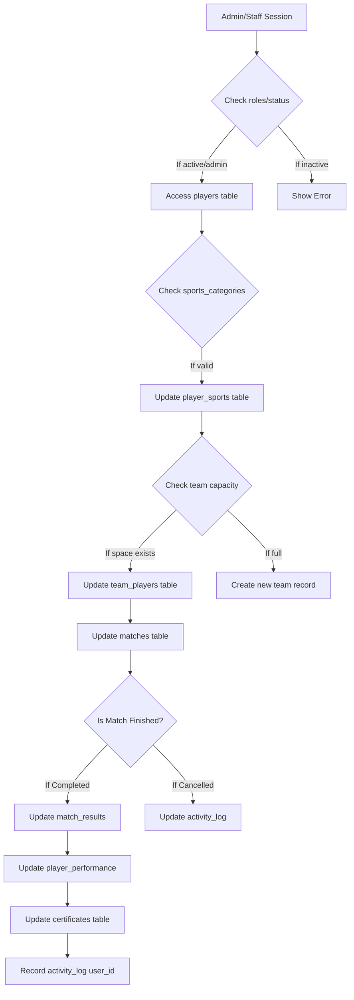

# Deep Analysis ER & Logic Diagram - College Sports Management System

This document provides a deep analysis of the database architecture, including PK/FK mappings, conditional logic (if/else), and the complete system workflow.

---

## 🏗️ Deep Analysis ER Diagram (Physical Schema)
This diagram maps the actual database tables with their Primary Keys (PK) and Foreign Keys (FK).

---

## 🔄 Complete System Workflow & Logic Flow
This diagram shows the **Deep Analysis** of how data moves between tables with **Condition Checks (If/Else)**.

---

## 📂 Database Table Analysis (PK/FK Mapping)

| Table Name | Primary Key (PK) | Foreign Keys (FK) | Logical Condition (If/Else) |
| :--- | :--- | :--- | :--- |
| **users** | `id` | None | `IF status='active' AND role='admin'` → Grant full access. |
| **players** | `id` | None | `IF status='active'` → Allow match participation. |
| **teams** | `id` | `sport_id` | `IF matches_won > 0` → Update leaderboard logic. |
| **matches** | `id` | `sport_id`, `team1_id`, `team2_id` | `IF team1_id == team2_id` → **ERROR** (Validation check). |
| **match_results** | `id` | `match_id`, `winner_team_id` | `IF winner_team_id IS NOT NULL` → Update team stats. |
| **certificates** | `id` | `player_id`, `sport_id`, `generated_by` | `IF issued` → Lock record from deletion. |

---

## 🔍 Deep Analysis Summary
1.  **Validation Logic**: The `matches` table has a recursive FK relationship where `team1_id` and `team2_id` must point to the `teams` table, but must be different (Condition: `IF id1 != id2`).
2.  **Audit Trail**: Every action (Diamond nodes in the flow) triggers an `INSERT` into the `activity_log` using the `users.id` as a Foreign Key.
3.  **Performance Scalability**: The `player_performance` table uses a composite-like lookup (FK match_id + FK player_id) to ensure one entry per player per match.
