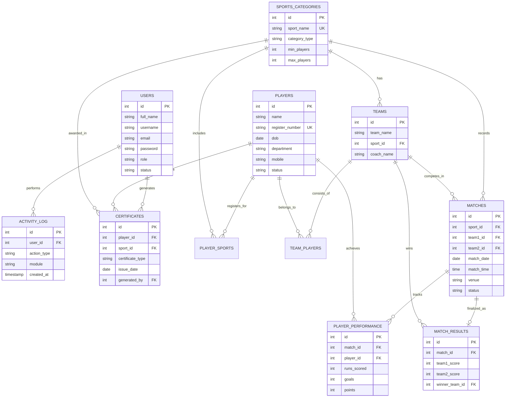

# Entity Relationship (ER) Diagram - College Sports Management System

This document provides a clean and detailed ER diagram for the system database.

---

## 📊 Entity Relationship Diagram

---

## 🔑 Key Relationships

| Relationship | Type | Description |
| :--- | :--- | :--- |
| **Players & Team** | Many-to-Many | A player can be in multiple teams, and teams have many players (via `team_players`). |
| **Teams & Sports** | Many-to-One | Multiple teams can exist for a single sport category. |
| **Matches & Teams** | One-to-Many | Each match involves two teams (`team1_id`, `team2_id`). |
| **Certificates** | One-to-Many | A player can earn multiple certificates managed by admins. |

---
