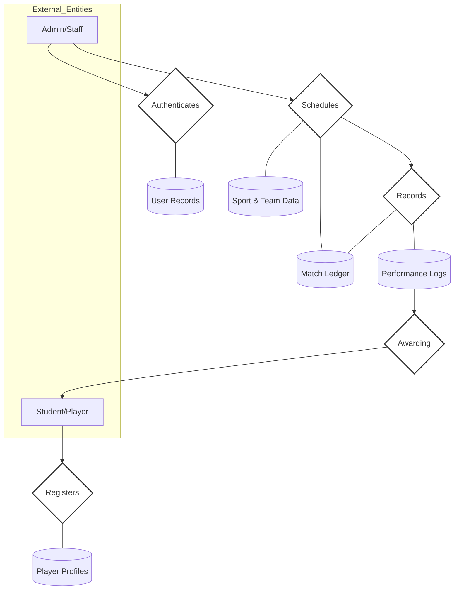

# Hybrid DFD-ER Flow Design - College Sports Management System

This diagram represents the system flow using **ER-style shapes** (Rectangles for Entities and Diamonds for Logic/Processes).

---

## 🏗️ System Flow (ER-Styled DFD)

---

## 📖 Symbol Key (ER vs DFD)

| Shape | ER Meaning | DFD Meaning | Usage in this Diagram |
| :--- | :--- | :--- | :--- |
| **Rectangle `[ ]`** | Entity | External Agent | Represents **Who** is using the system (Student/Admin). |
| **Diamond `{ }`** | relationship | Process | Represents the **Action** or Logic being performed. |
| **Cylinder `[( )]`** | N/A | Data Store | Represents the **Database Tables** where data is kept. |

---

### **Flow Explanation:**
1.  **Student** initiates a **Registration** action (Diamond), which stores data in **Player Profiles**.
2.  **Admin** performs **Authentication** (Diamond) against **User Records**.
3.  **Admin** creates **Schedules** (Diamond), pulling from **Sport Data** and writing to the **Match Ledger**.
4.  Once a match is played, the system **Records** (Diamond) results into **Performance Logs**.
5.  Finally, the system initiates **Awarding** (Diamond) to send certificates back to the **Student**.
