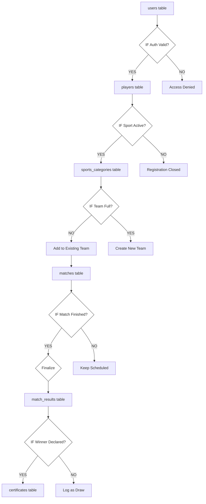

# Unified Project ER-Flow Diagram - College Sports Management System

This document merges the **Database Structure (ER)** with the **System Flow & Condition Logic (If/Else)** into a single, cohesive technical blueprint.

---

## 🏗️ Project ER-Flow Design (with Condition Logic)
This diagram shows the journey of data through the system, including the critical decision points that control the flow.

---

## 📑 Detailed Flow & Logic Analysis

| Step | Data Source | Logic Condition (IF/ELSE) | Success Action | Failure/Alternate Action |
| :--- | :--- | :--- | :--- | :--- |
| **Auth** | `users` | **IF** `username/pass` matches | Grant access to `players` registry. | Return 401 Unauthorized error. |
| **Reg** | `players` | **IF** `sport_status` is 'active' | Proceed to `sports_categories`. | Show "Registration Closed" msg. |
| **Team** | `sports` | **IF** `members < max_players` | Update `team_players` table. | **ELSE** CREATE new entry in `teams`. |
| **Match** | `matches` | **IF** `match_status` is 'completed'| Trigger `match_results` update. | Keep status as 'scheduled'. |
| **Award** | `results` | **IF** `winner_id` is NOT NULL | Generate entry in `certificates`. | Log result as 'Draw/Tie'. |

---

## 🔍 Deep Analysis of the ER-Flow
1.  **Data Persistence**: Every "YES" path results in a `COMMIT` to the database (linked by PK/FK).
2.  **Relational Integrity**: 
    - `C1` ensures that no one can modify `players` without a valid `users.id`.
    - `C3` ensures that the `teams.sport_id` always matches the `sports_categories.id`.
3.  **Workflow Finality**: The flow ends at `certificates`, which is a "Read-Only" state triggered by the result of `C5`.

---
